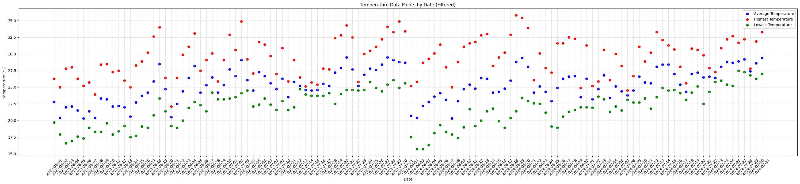

# 기상청 데이터 클러스터링 분석

## 주제 선택
- 클러스터링을 사용해 보고 싶어 클러스터링을 이용할 수 있는 데이터 셋을 한번 찾아보려고 함
- 스포티파이 데이터셋 (클러스터링에 적합한 데이터 셋이 아님)
- 기상청 데이터셋 / 습도, 기온, 일조일사와 강수량 사이에 유의미한 연관 관계를 뽑아 낼 수 있을 것으로 추정

## 과정
1. **기상청 데이터 시각화**  
   - `matplotlib` 라이브러리를 이용하여 기상청 데이터(기온, 습도, 일조일사) 시각화  
     - 기온
      
     - 습도
       
     - 일조일사
       

2. **데이터 병합**  
   - 기온, 습도, 일조일사 데이터가 다른 csv 파일에 나누어져 있어서 데이터셋을 날짜를 기준으로 머지  

3. **3차원 시각화**  
   - `matplotlib` 라이브러리를 이용해 평균 습도, 총 자외선 양, 평균 온도를 3차원에 시각화  

4. **KMeans 클러스터링**  
   - `sklearn` 라이브러리를 이용해 KMeans 기법으로 클러스터링 진행  
     - `StandardScaler`를 사용하여 데이터의 평균을 0, 표준 편차를 1로 맞춤  
     - **Elbow Method**  
       - Elbow Method는 클러스터링에서 최적의 클러스터 수 `k`를 찾는 방법
         
     - **inertia**
       - 클러스터의 중심에 가깝게 위치하는지를 측정, 데이터 포인트가 속한 클러스터 중심까지의 거리를 제곱한 값의 합  
     - Elbow Method를 이용해서 `k` 값을 inertia 값이 급격히 떨어지는 값으로 설정  
     - `k` 값이 3이 적당함  
     - **KMeans를 이용한 클러스터링**  
       - 클러스터링 값을 데이터셋에 병합
         

5. **강수량 데이터 병합**  
   - 강수량 데이터셋을 클러스터링 값이 있는 데이터 셋에 병합  
     - 강수량 값이 비어있으면 0을 넣음  
     - 강수량 값이 0이면 0을, 0보다 크면 1을 넣어 비가 왔는지 확인하는 행을 만듬  

6. **결과 분석**  
   - `k=3`으로 설정하여 클러스터링 진행  
     - **결과**  
       - 0번 영역 비올 확률: 90%  
       - 1번 영역 비올 확률: 10%  
       - 2번 영역 비올 확률: 45%  

## K값 조정 및 재분석  
   - 결론이 마음에 들지 않아 `k=2`로 설정하고 클러스터링 재진행
     
     - **결과**  
       - 0번 영역 비올 확률: 90%  
       - 1번 영역 비올 확률: 20%  
  
  
       
The following text was originally written in Korean and then translated into English.  

# Clustering Analysis of Meteorological Data

## Topic Selection
- Wanted to experiment with clustering, so I started looking for a dataset that would be suitable for clustering analysis.
- Considered using the Spotify dataset but found it unsuitable for clustering.
- Decided on the meteorological dataset, anticipating the potential to extract meaningful relationships between humidity, temperature, solar radiation, and precipitation.

## Process

1. **Visualization of Meteorological Data**
   - Used the `matplotlib` library to visualize meteorological data (temperature, humidity, and solar radiation).
     - Temperature  
       
     - Humidity  
       
     - Solar Radiation  
       

2. **Data Merging**
   - Since the temperature, humidity, and solar radiation data were stored in separate CSV files, merged these datasets based on dates.

3. **3D Visualization**
   - Visualized average humidity, total UV exposure, and average temperature in 3D using the `matplotlib` library.

4. **KMeans Clustering**
   - Applied KMeans clustering using the `sklearn` library.
     - Standardized the data with `StandardScaler`, setting the mean to 0 and the standard deviation to 1.
     - **Elbow Method**
       - Employed the Elbow Method to determine the optimal number of clusters, `k`.
         
     - **Inertia**
       - Measured the closeness of data points to their cluster centers, calculated as the sum of squared distances from each data point to the cluster center.
     - Set the `k` value based on the sharp drop in inertia, determining that `k=3` was appropriate.
     - **Clustering with KMeans**
       - Merged the clustering results back into the dataset.
         

5. **Merging Precipitation Data**
   - Merged the precipitation dataset with the clustered dataset.
     - Filled empty precipitation values with 0.
     - Created a new column to indicate whether it rained (1 if precipitation > 0, 0 otherwise).

6. **Result Analysis**
   - Conducted clustering analysis with `k=3`.
     - **Results**
       - Probability of rain in Region 0: 90%
       - Probability of rain in Region 1: 10%
       - Probability of rain in Region 2: 45%

## Adjustment of K Value and Reanalysis
   - Unsatisfied with the initial results, reset `k=2` and re-clustered.
     
     - **Results**
       - Probability of rain in Region 0: 90%
       - Probability of rain in Region 1: 20%
